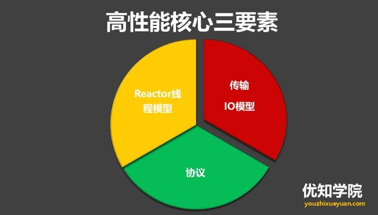

## 总体架构
Netty 采用了比较典型的三层网络架构进行设计，逻辑架构图如下所示：

1. Core 核心：可扩展事件模型、通用通信 API、支持零拷贝的 ByteBuf 缓冲对象。

2. 传输服务：支持 BIO 和 NIO。

3. 协议支持：HTTP、Protobuf、二进制、文本、WebSocket 等一系列常见协议都支持。还支持通过实行编码解码逻辑来实现自定义协议。

4. 容器集成：支持 OSGI、JBossMC、Spring、Guice 容器。

## 高性能设计
高性能核心三要素：

* 传输
用什么样的通道将数据发送给对方，BIO、NIO 或者 AIO，**IO 模型在很大程度上决定了框架的性能**。
Netty 的 I/O 模型基于非阻塞 I/O 实现，底层依赖的是 JDK NIO 框架的 Selector。

* 协议
采用什么样的通信协议，HTTP或者内部私有协议。协议的选择不同，性能模型也不同。相比于公有协议，内部私有协议的性能通常可以被设计的更优。

* 线程
数据报如何读取？读取之后的编解码在哪个线程进行，编解码后的消息如何派发，Reactor 线程模型的不同，对性能的影响也非常大。
Reactor 线程模型有三种：Reactor 单线程模型、Reactor 多线程模型、主从 Reactor 多线程模型。Netty 的线程模型是**主从 Reactor 多线程模型**去掉线程池后的变种，这也是Netty NIO的默认模式。

## 参考资料
1. (高并发架构系列：Netty的实现原理、特点与优势、以及适用场景)[https://youzhixueyuan.com/netty-implementation-principle.html]

