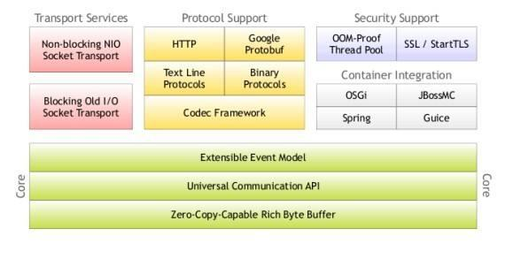
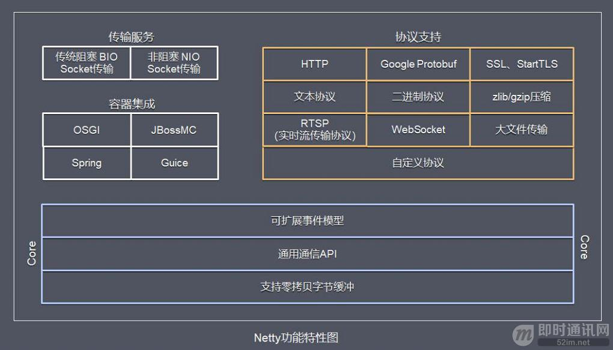

Netty 采用了比较典型的三层网络架构进行设计，逻辑架构图如下所示：

1. Core 核心：可扩展事件模型、通用通信 API、支持零拷贝的 ByteBuf 缓冲对象。

2. 传输服务：支持 BIO 和 NIO。

3. 协议支持：HTTP、Protobuf、二进制、文本、WebSocket 等一系列常见协议都支持。还支持通过实行编码解码逻辑来实现自定义协议。

4. 容器集成：支持 OSGI、JBossMC、Spring、Guice 容器。

## 参考资料
1. [高并发架构系列：Netty的实现原理、特点与优势、以及适用场景](https://youzhixueyuan.com/netty-implementation-principle.html)

