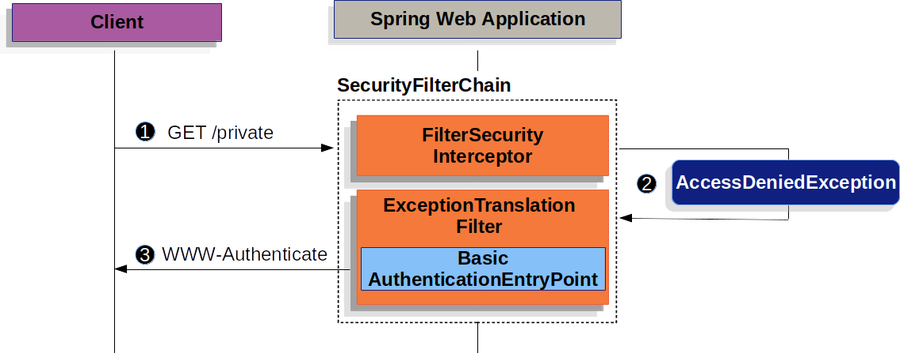

Spring Security为身份验证提供了全面的支持。本文讨论：

**架构组件**

本节描述 Servlet 身份验证中使用的 Spring Security 的主要体系结构组件。

* SecurityContextHolder - SecurityContextHolder 是 Spring Security 存储身份验证者详细信息的地方。
* SecurityContext - 从 SecurityContextHolder 中获取，并包含当前经过身份验证的用户的身份验证。 
* Authentication - 可以是 AuthenticationManager 的输入，提供用户已提供的认证凭证，还是 SecurityContext 的当前用户。
* GrantedAuthority - 授予主体的身份验证权限（如角色、范围等）。
* AuthenticationManager - 定义 Spring Security 的 Filters 如何执行身份验证的 API。
* ProviderManager - AuthenticationManager 最常见的实现。
* AuthenticationProvider - 由 ProviderManager 用于执行特定类型的身份验证。
* Request Credentials with AuthenticationEntryPoint - 用于从客户端请求凭据（如重定向到登录页面，发送 WWW-Authenticate 响应，等等）。
* AbstractAuthenticationProcessingFilter - 用于身份验证的基本 Filter。这也让我们很好地了解了高层次的身份验证流以及各个部分如何协同工作。

**身份验证机制**
* Username and Password - 如何使用用户名/密码进行身份验证。
* OAuth 2.0 Login - 使用 OpenID Connect 和非标准 OAuth 2.0 登录的 OAuth 2.0 登录（如 GitHub）。
* SAML 2.0 Login - SAML 2.0 登录。
* Central Authentication Server (CAS) - 中央认证服务器(CAS)支持。
* Remember Me - 如何记住用户过去的会话过期。
* JAAS Authentication - JAAS 身份验证。
* OpenID - OpenID 身份验证(不要与 OpenID Connect 混淆)
* Pre-Authentication Scenarios - 使用外部机制（如 SiteMinder 或 Java EE security）进行身份验证，但仍然使用 Spring security 进行授权和保护，以防止常见的攻击。
* X509 Authentication - X509 身份验证。

## SecurityContextHolder
Spring Security 的身份验证模型的核心是 SecurityContextHolder。它包含 SecurityContext。


SecurityContextHolder 是 Spring Security 存储身份验证者详细信息的地方。Spring Security 并不关心 SecurityContext 如何填充。如果它包含一个值，那么它将被用作当前经过身份验证的用户。

指示用户已通过身份验证的最简单方法是直接设置 SecurityContextHolder。

```java
SecurityContext context = SecurityContextHolder.createEmptyContext(); 
Authentication authentication =
    new TestingAuthenticationToken("username", "password", "ROLE_USER"); 
context.setAuthentication(authentication);

SecurityContextHolder.setContext(context); 
```

1. 我们首先创建一个空的 SecurityContext。创建一个新的 SecurityContext 实例而不是使用 SecurityContextHolder.getContext().setAuthentication(authentication) 来避免多线程的竞争条件是很重要的。

2. 接下来，我们创建一个新的 Authentication 对象。Spring Security 并不关心在 SecurityContext 上设置了什么类型的身份验证实现。这里我们使用 TestingAuthenticationToken，因为它非常简单。更常见的生产场景是 UsernamePasswordAuthenticationToken(userDetails, password, authorities)。

3. 最后，我们在 SecurityContextHolder 上设置 SecurityContext。Spring Security将使用这些信息进行授权。

如果希望获得关于经过身份验证的主体的信息，可以通过访问 SecurityContextHolder 来实现。

```java
SecurityContext context = SecurityContextHolder.getContext();
Authentication authentication = context.getAuthentication();
String username = authentication.getName();
Object principal = authentication.getPrincipal();
Collection<? extends GrantedAuthority> authorities = authentication.getAuthorities();
```

**默认情况下，SecurityContext 使用一个 ThreadLocal 来存储这些细节**，这意味着 SecurityContext 始终对同一执行线程中的方法可用，即使 SecurityContext 没有作为参数显式地传递给这些方法。如果在当前主体的请求被处理后小心地清除线程，那么以这种方式使用 ThreadLocal 是非常安全的。Spring Security 的 FilterChainProxy 确保总是清除 SecurityContext。

有些应用程序并不完全适合使用 ThreadLocal，因为它们使用线程的特定方式。例如，Swing 客户机可能希望 Java 虚拟机中的所有线程使用相同的安全上下文。SecurityContext 可以在启动时配置一个策略来指定希望如何存储上下文。对于一个独立的应用程序，将使用 SecurityContextHolder.MODE_GLOBAL 策略。其他应用程序可能希望安全线程派生的线程也具有相同的安全标识。这是通过使用 SecurityContextHolder.MODE_INHERITABLETHREADLOCAL 来实现的。我们有两种方式可以从默认的 SecurityContextHolder.MODE_THREADLOCAL 中更改模式。第一种是设置一个系统属性，第二种是调用 SecurityContextHolder 中的一个静态方法。

## SecurityContext
SecurityContext 是从 SecurityContextHolder 中获取的。SecurityContext 包含一个 Authentication 对象。

## Authentication
在 Spring Security 中，Authentication 有两个主要目的：
* AuthenticationManager 的输入，用于提供用户提供的用于身份验证的凭据。在此场景中使用时，isAuthenticated() 返回 false。
* 表示当前经过身份验证的用户。当前的身份验证可以从 SecurityContext 中获得。

Authentication 包含:
* principal(主题) - 标识用户。在使用用户名/密码进行身份验证时，这通常是 UserDetails 的一个实例。
* credentials(凭证) - 通常是密码。在许多情况下，在对用户进行身份验证以确保其不被泄漏之后，会清除此信息。
* authorities(权限) - GrantedAuthoritys 是授予用户的高级权限。一些例子是 roles(角色) 或 scopes(范围)。

## GrantedAuthority
GrantedAuthoritys 是授予用户的高级权限。一些例子是角色或范围。

可以通过 Authentication.getAuthorities() 方法获得 GrantedAuthoritys。此方法提供 GrantedAuthority 对象的集合。GrantedAuthority 是授予主体的权力，这并不奇怪。这些权限通常是“角色”，例如 ROLE_ADMINISTRATOR 或 ROLE_HR_SUPERVISOR。稍后将为 web 授权、方法授权和域对象授权配置这些角色。Spring Security 的其他部分能够解释这些权限，并期待它们的出现。当使用基于用户名/密码的身份验证时，GrantedAuthoritys 通常由 UserDetailsService 加载。

通常，GrantedAuthority 对象是应用程序范围的权限。它们并不特定于给定的域对象。因此，我们可能没有 GrantedAuthority 来表示对 Employee 对象编号 54 的权限，因为如果有成千上万个这样的权限，那么很快就会耗尽内存（或者，至少会导致应用程序需要很长时间来验证用户）。当然，Spring Security 是专门为处理这一常见需求而设计的，但是我们应该使用项目的域对象安全功能来实现这一目的。

## AuthenticationManager
AuthenticationManager 是定义 Spring Security 的 Filters 如何执行身份验证的 API。然后，由调用 AuthenticationManager 的控制器（如 Spring Security的 Filters）在SecurityContextHolder上设置返回的 Authentication 。如果我们没有与 Spring Security 的 Filters 集成，可以直接设置 SecurityContextHolder，不需要使用 AuthenticationManager。

虽然 AuthenticationManager 的实现可以是任何东西，但最常见的实现是 ProviderManager。

## ProviderManager
ProviderManager 是 AuthenticationManager 最常用的实现。ProviderManager 委托给 AuthenticationProviders 列表。每个 AuthenticationProvider 都有机会指示身份验证应该成功、失败，或者指示它不能做出决定并允许下游的 AuthenticationProvider 做出决定。如果配置的 AuthenticationProvider 都不能进行身份验证，则身份验证将失败，并抛出 ProviderNotFoundException，这是一个特殊的 AuthenticationException，表明 ProviderManager 不支持传递给它的 Authentication 类型。


实际上，每个 AuthenticationProvider 都知道如何执行特定类型的身份验证。例如，一个 AuthenticationProvider 可能能够验证用户名/密码，而另一个可能能够验证 SAML 断言。这允许每个 AuthenticationProvider 执行一种非常特定的身份验证类型，同时支持多种类型的身份验证，并且只公开一个 AuthenticationManager bean。

ProviderManager 还允许配置一个可选的父 AuthenticationManager，如果没有 AuthenticationProvider 可以执行身份验证，就会咨询它。父类可以是任何类型的 AuthenticationManager，但它通常是 ProviderManager 的一个实例。


实际上，多个 ProviderManager 实例可能共享同一个父 AuthenticationManager。这在有多个 SecurityFilterChain 实例的场景中比较常见，这些实例有一些共同的身份验证（共享的父 AuthenticationManager），但也有不同的身份验证机制（不同的 ProviderManager实例）。


默认情况下，ProviderManager 将尝试从成功的身份验证请求返回的 Authentication 对象中清除任何敏感的凭据信息。这可以防止密码等信息在 HttpSession 中保留的时间超过必要的时间。

这可能会在使用用户对象的缓存时造成问题，例如，在无状态应用程序中提高性能。如果身份验证包含对缓存中的对象的引用(例如 UserDetails 实例)，并且该对象的凭据已被删除，那么将无法根据缓存的值进行身份验证。如果使用缓存，则需要考虑这一点。一个明显的解决方案是，首先在缓存实现中或在创建返回的 Authentication 对象的 AuthenticationProvider 中复制对象。或者，可以在 ProviderManager 上禁用 eraseCredentialsAfterAuthentication 属性。

## AuthenticationProvider
可以将多个 AuthenticationProvider 注入到 ProviderManager 中。每个 AuthenticationProvider 执行特定类型的身份验证。例如，DaoAuthenticationProvider 支持基于用户名/密码的身份验证，而 JwtAuthenticationProvider 支持对 JWT 令牌进行身份验证。

## Request Credentials with AuthenticationEntryPoint
AuthenticationEntryPoint 用于发送从客户端请求凭据的 HTTP 响应。

有时客户端会主动地包含诸如用户名/密码之类的凭据来请求资源。在这些情况下，Spring Security 不需要提供从客户端请求凭据的 HTTP 响应，因为它们已经包含在内了。

在其他情况下，客户端将向未经授权访问的资源发出未经身份验证的请求。在这种情况下，AuthenticationEntryPoint 的实现用于从客户端请求凭据。AuthenticationEntryPoint 实现可以重定向到登录页面，使用  WWW-Authenticate header 响应，等等。

## AbstractAuthenticationProcessingFilter
AbstractAuthenticationProcessingFilter 用作验证用户凭证的基本 Filter。在认证凭证之前，Spring Security 通常使用 AuthenticationEntryPoint 请求凭证。

接下来，AbstractAuthenticationProcessingFilter 可以对提交给它的任何身份验证请求进行身份验证。


1. 当用户提交他们的凭证时，
AbstractAuthenticationProcessingFilter 将从要进行身份验证的 HttpServletRequest 创建 Authentication。创建的 Authentication 的类型取决于 AbstractAuthenticationProcessingFilter 的子类。例如，UsernamePasswordAuthenticationFilter 根据在 HttpServletRequest 中提交的用户名和密码创建 UsernamePasswordAuthenticationToken。

2. 接下来，将 Authentication 传递到 AuthenticationManager 以进行身份验证。

3. 如果验证失败，则失败
    + SecurityContextHolder 清除。
    + RememberMeServices.loginFail 被调用。如果 remember me 没有配置，这是一个 no-op。
    + AuthenticationFailureHandler 被调用。

4. 如果认证成功，则成功。
    + SessionAuthenticationStrategy 在新登录时得到通知。
    + Authentication 是在  SecurityContextHolder 中设置的。稍后 SecurityContextPersistenceFilter 将 SecurityContext 保存到 HttpSession 中。
    + RememberMeServices.loginSuccess 被调用。如果 remember me 没有配置，这是一个 no-op。
    + ApplicationEventPublisher 发布一个 InteractiveAuthenticationSuccessEvent。
    
## Username/Password Authentication
验证用户身份最常用的方法之一是验证用户名和密码。因此，Spring Security 为使用用户名和密码进行身份验证提供了全面的支持。

**读取用户名和密码**

Spring Security 提供了以下内置机制，用于从 HttpServletRequest 读取用户名和密码：
* 表单登录
* Basic 身份验证
* Digest 式身份验证

**存储机制**
每种支持的读取用户名和密码的机制都可以利用任何一种支持的存储机制：
* 内存身份验证的简单的存储
* JDBC 身份验证的关系数据库
* 使用 UserDetailsService 自定义数据存储
* LDAP 身份验证的 LDAP 存储

### Form Login
Spring Security 支持通过 html 表单提供用户名和密码。本节将详细介绍基于表单的身份验证在 Spring Security 中是如何工作的。

让我们看看在 Spring Security 中基于表单的登录是如何工作的。首先，我们将看到如何将用户重定向到登录表单。


1. 用户向未授权的 resource /private 发出未经身份验证的请求。

2. Spring Security 的 FilterSecurityInterceptor 通过抛出 AccessDeniedException 来拒绝未经身份验证的请求。

3. 因为用户没有经过身份验证，ExceptionTranslationFilter 启动身份验证，并使用配置的 AuthenticationEntryPoint 向登录页面发送重定向。在大多数情况下，AuthenticationEntryPoint 是 LoginUrlAuthenticationEntryPoint 的实例。

4. 浏览器将请求它被重定向到的登录页面。

5. 在应用程序中，必须呈现登录页面。

提交用户名和密码时，UsernamePasswordAuthenticationFilter 将对用户名和密码进行身份验证。UsernamePasswordAuthenticationFilter 扩展了 AbstractAuthenticationProcessingFilter，所以这个关系图应该看起来非常类似。


1. 当用户提交他们的用户名和密码时，UsernamePasswordAuthenticationFilter 通过从 HttpServletRequest 中提取用户名和密码来创建 UsernamePasswordAuthenticationToken，这是一种 Authentication 类型。

2. 将 UsernamePasswordAuthenticationToken 传递到 AuthenticationManager 进行身份验证。AuthenticationManager 的详细信息取决于如何存储用户信息。

3. 如果验证失败，则失败。
    + SecurityContextHolder 清除。
    + RememberMeServices.loginFail 被调用。如果 remember me 没有配置，这是一个 no-op。
    + AuthenticationFailureHandler 被调用。

4. 如果认证成功，则成功。
    + SessionAuthenticationStrategy 在新登录时得到通知。
    + Authentication 是在 SecurityContextHolder 中设置的。
    + RememberMeServices.loginSuccess 被调用。如果 remember me 没有配置，这是一个 no-op。
    + ApplicationEventPublisher 发布一个 InteractiveAuthenticationSuccessEvent。
    + 调用 AuthenticationSuccessHandler。通常这是一个 SimpleUrlAuthenticationSuccessHandler，当我们重定向到登录页面时，它会重定向到 ExceptionTranslationFilter 保存的请求。

默认情况下启用了 Spring Security 表单登录。但是，一旦提供了任何基于 servlet 的配置，就必须显式地提供基于表单的登录。一个最小的，明确的 Java 配置可以找到如下：

```java
protected void configure(HttpSecurity http) {
    http
        // ...
        .formLogin(withDefaults());
}
```

在这个配置中，Spring Security 将呈现一个默认的登录页面。大多数生产应用程序将需要自定义登录表单。

下面的配置演示了如何在表单中提供自定义登录表单。

```java
protected void configure(HttpSecurity http) throws Exception {
    http
        // ...
        .formLogin(form -> form
            .loginPage("/login")
            .permitAll()
        );
}
```

当在 Spring Security 配置中指定登录页面时，我们将负责呈现页面。下面是一个 Thymeleaf 模板，产生一个 HTML 登录表单，符合登录页面/登录。

```html
<!DOCTYPE html>
<html xmlns="http://www.w3.org/1999/xhtml" xmlns:th="https://www.thymeleaf.org">
    <head>
        <title>Please Log In</title>
    </head>
    <body>
        <h1>Please Log In</h1>
        <div th:if="${param.error}">
            Invalid username and password.</div>
        <div th:if="${param.logout}">
            You have been logged out.</div>
        <form th:action="@{/login}" method="post">
            <div>
            <input type="text" name="username" placeholder="Username"/>
            </div>
            <div>
            <input type="password" name="password" placeholder="Password"/>
            </div>
            <input type="submit" value="Log in" />
        </form>
    </body>
</html>
```

关于默认的 HTML 表单有以下几点要点：
* 表单应该执行 post 到 /login
* 该表单需要包含一个 CSRF 令牌，该令牌由 Thymeleaf 自动包含
* 表单应该在名为 username 的参数中指定用户名
* 表单应该在名为 password 的参数中指定密码
* 如果发现 HTTP 参数错误，则表示用户未能提供有效的用户名/密码
* 如果找到 HTTP 参数 logout，则表示用户已成功登出

许多用户只需要自定义登录页面即可。但是，如果需要，以上所有内容都可以通过额外的配置进行定制。

如果正在使用Spring MVC，将需要一个将 GET /login 映射到我们创建的登录模板的 controller。一个最小的样本 LoginController 可以看到如下：

```java
@Controller
class LoginController {
    @GetMapping("/login")
    String login() {
        return "login";
    }
}
```

### Basic Authentication
本节详细介绍 Spring Security 如何为基于 servlet 的应用程序提供对 Basic HTTP 身份验证的支持。

让我们看看 HTTP Basic 身份验证在 Spring Security 中是如何工作的。首先，我们看到 WWW-Authenticate header 被发送回未经身份验证的客户端。



1. 首先，用户向未授权的 resource /private 发出未经身份验证的请求。

2. Spring Security 的 FilterSecurityInterceptor 通过抛出 AccessDeniedException 来拒绝未经身份验证的请求。

3. 因为用户没有经过身份验证，ExceptionTranslationFilter 会启动 Start Authentication。配置的 AuthenticationEntryPoint 是一个 BasicAuthenticationEntryPoint 实例，它发送一个 WWW-Authenticate header。RequestCache 通常是一个 NullRequestCache，它不保存请求，因为客户端能够重放它最初请求的请求。

当客户端收到 WWW-Authenticate header 时，它知道应该使用用户名和密码重试。下面是正在处理的用户名和密码流程。


1. 当用户提交他们的用户名和密码时，UsernamePasswordAuthenticationFilter 通过从 HttpServletRequest 中提取用户名和密码来创建 UsernamePasswordAuthenticationToken，这是一种 Authentication 类型。

2. 将 UsernamePasswordAuthenticationToken 传递到 AuthenticationManager 进行身份验证。AuthenticationManager 的详细信息取决于如何存储用户信息。

3. 如果验证失败，则失败。
    + SecurityContextHolder 清除。
    + RememberMeServices.loginFail 被调用。如果 remember me 没有配置，这是一个 no-op。
    + 调用 AuthenticationEntryPoint 来触发再次发送 WWW-Authenticate。

4. 如果认证成功，则成功。
    + Authentication 是在 SecurityContextHolder 中设置的。
    + RememberMeServices.loginSuccess 被调用。如果 remember me 没有配置，这是一个 no-op。
    + BasicAuthenticationFilter 调用 FilterChain.doFilter(request,response) 来继续应用程序逻辑的其余部分。

Spring Security 的 HTTP Basic 身份验证支持在默认情况下是启用的。但是，一旦提供了任何基于 servlet 的配置，就必须显式地提供 HTTP Basic。

一个最小的，明确的配置可以找到如下：

```java
protected void configure(HttpSecurity http) {
    http
        // ...
        .httpBasic(withDefaults());
}
```

### Digest Authentication
不应该在现代应用程序中使用摘要身份验证，因为它被认为是不安全的。最明显的问题是，必须以明文、加密或 MD5 格式存储密码。所有这些存储格式都被认为是不安全的。相反，应该使用一种单向自适应密码散列（如 bCrypt、PBKDF2、SCrypt 等）来存储凭证，这种方式不受 Digest 身份验证的支持。

### In-Memory Authentication
Spring Security 的 InMemoryUserDetailsManager 实现了 UserDetailsService，为在内存中检索的基于用户名/密码的身份验证提供支持。通过实现 UserDetailsManager 接口，InMemoryUserDetailsManager提供了对用户详细信息的管理。当 Spring Security 配置为接受用户名/密码进行身份验证时，它将使用基于 UserDetails 的身份验证。

在本例中，我们使用 Spring Boot CLI 对 password 的密码进行编码，得到的编码密码为 {bcrypt}$2a$10$GRLdNijSQMUvl/au9ofL.eDwmoohzzS7.rmNSJZ.0FxO/BTk76klW。

```java
@Bean
public UserDetailsService users() {
    UserDetails user = User.builder()
        .username("user")
        .password("{bcrypt}$2a$10$GRLdNijSQMUvl/au9ofL.eDwmoohzzS7.rmNSJZ.0FxO/BTk76klW")
        .roles("USER")
        .build();
    UserDetails admin = User.builder()
        .username("admin")
        .password("{bcrypt}$2a$10$GRLdNijSQMUvl/au9ofL.eDwmoohzzS7.rmNSJZ.0FxO/BTk76klW")
        .roles("USER", "ADMIN")
        .build();
    return new InMemoryUserDetailsManager(user, admin);
}
```

上面的示例以安全格式存储密码，但是在入门体验方面还有很多需要改进的地方。

在下面的示例中，我们利用 User.withDefaultPasswordEncoder 来确保存储在内存中的密码是受保护的。但是，它不能保护密码不被反编译源代码而获得密码。因此，User.withDefaultPasswordEncoder 应仅用于“入门”，而不用于生产。

```java
@Bean
public UserDetailsService users() {
    // The builder will ensure the passwords are encoded before saving in memory
    UserBuilder users = User.withDefaultPasswordEncoder();
    UserDetails user = users
        .username("user")
        .password("password")
        .roles("USER")
        .build();
    UserDetails user = users
        .username("admin")
        .password("password")
        .roles("USER", "ADMIN")
        .build();
    return new InMemoryUserDetailsManager(user, admin);
}
```

### JDBC Authentication
Spring Security 的 JdbcDaoImpl 实现了 UserDetailsService，为使用 JDBC 检索的基于用户名/密码的身份验证提供支持。JdbcUserDetailsManager 扩展了 JdbcDaoImpl，通过 UserDetailsManager 接口提供对用户详细信息的管理。当 Spring Security 配置为接受用户名/密码进行身份验证时，它将使用基于 UserDetails 的身份验证。

#### Default Schema
Spring Security 为基于 JDBC 的身份验证提供默认查询。本节提供与默认查询一起使用的相应默认 schemas。根据实际需要调整 schema，使其与使用的查询和数据库方言匹配任何自定义。

##### User Schema
JdbcDaoImpl 要求使用表来加载用户的密码、帐户状态（启用或禁用）和权限（角色）列表。

```sql
create table users
(
    username varchar(50) not null comment '用户名',
    password varchar(100) not null comment '密码',
    enabled  bit(1)      not null comment '是否启用',
    PRIMARY KEY (`username`)
) ENGINE = InnoDB
  DEFAULT CHARSET = utf8mb4
  COLLATE = utf8mb4_0900_ai_ci;

create table authorities
(
    username  varchar(50) not null comment '用户名',
    authority varchar(255) not null comment '权限'
) ENGINE = InnoDB
  DEFAULT CHARSET = utf8mb4
  COLLATE = utf8mb4_0900_ai_ci;
```

默认的 schema 还作为一个名为 org/springframework/security/core/userdetails/jdbc/users.ddl 的类路径资源公开。

##### Group Schema
如果应用程序正在使用 groups，则需要提供 groups schema。

```sql
create table `groups`
(
    id         bigint AUTO_INCREMENT not null comment '主键',
    group_name varchar(50)           not null comment '用户组名',
    PRIMARY KEY (`id`)
) ENGINE = InnoDB
  DEFAULT CHARSET = utf8mb4
  COLLATE = utf8mb4_0900_ai_ci;

create table group_authorities
(
    group_id  bigint      not null comment '用户组id',
    authority varchar(255) not null comment '用户组权限'
) ENGINE = InnoDB
  DEFAULT CHARSET = utf8mb4
  COLLATE = utf8mb4_0900_ai_ci;

create table group_members
(
    id       bigint AUTO_INCREMENT not null comment '主键',
    username varchar(50)           not null comment '用户名',
    group_id bigint                not null comment '用户组id',
    PRIMARY KEY (`id`)
) ENGINE = InnoDB
  DEFAULT CHARSET = utf8mb4
  COLLATE = utf8mb4_0900_ai_ci;
```

#### Setting up a DataSource
在配置 JdbcUserDetailsManager 之前，必须创建一个 DataSource。

#### JdbcUserDetailsManager Bean
在本例中，我们使用 Spring Boot CLI 对 password 的密码进行编码，得到的编码密码为 {bcrypt}$2a$10$GRLdNijSQMUvl/au9ofL.eDwmoohzzS7.rmNSJZ.0FxO/BTk76klW。

```java
@Bean
UserDetailsManager users(DataSource dataSource) {
    UserDetails user = User.builder()
        .username("user")
        .password("{bcrypt}$2a$10$GRLdNijSQMUvl/au9ofL.eDwmoohzzS7.rmNSJZ.0FxO/BTk76klW")
        .roles("USER")
        .build();
    UserDetails admin = User.builder()
        .username("admin")
        .password("{bcrypt}$2a$10$GRLdNijSQMUvl/au9ofL.eDwmoohzzS7.rmNSJZ.0FxO/BTk76klW")
        .roles("USER", "ADMIN")
        .build();
    JdbcUserDetailsManager users = new JdbcUserDetailsManager(dataSource);
    users.createUser()
}
```

### UserDetails
UserDetails 由 UserDetailsService 返回。DaoAuthenticationProvider 验证 UserDetails，然后返回一个 Authentication，该 Authentication 的主体是配置的 UserDetailsService 返回的 UserDetails。

### UserDetailsService
UserDetailsService 由 DaoAuthenticationProvider 用于检索用户名、密码和其他属性，用于使用用户名和密码进行身份验证。Spring Security 提供了 UserDetailsService 的内存和 JDBC 实现。

通过将自定义的 UserDetailsService 公开为 Bean，可以定义自定义身份验证。例如，假设 CustomUserDetailsService 实现了 UserDetailsService，下面将自定义身份验证：

```java
@Bean
CustomUserDetailsService customUserDetailsService() {
    return new CustomUserDetailsService();
}
```

注意：只有在没有填充 AuthenticationManagerBuilder 且没有定义 AuthenticationProviderBean 时才使用此方法。

### PasswordEncoder
Spring Security 的 servlet 通过与 PasswordEncoder 集成来支持安全存储密码。可以通过公开 PasswordEncoder Bean 来定制 Spring Security 使用的 PasswordEncoder 实现。

### DaoAuthenticationProvider
DaoAuthenticationProvider 是一个 AuthenticationProvider 实现，它利用 UserDetailsService 和 PasswordEncoder 来验证用户名和密码。

让我们来看看 DaoAuthenticationProvider 在 Spring Security 中是如何工作的。该图详细解释了 AuthenticationManager 在读取用户名和密码时的工作方式。


1. 来自读取用户名和密码的身份验证 Filter 将 UsernamePasswordAuthenticationToken 传递给 AuthenticationManager，后者由 ProviderManager 实现。

2. ProviderManager 被配置为使用类型为 DaoAuthenticationProvider 的 AuthenticationProvider。

3. DaoAuthenticationProvider 从 UserDetailsService 中查找用户详细信息。

4. DaoAuthenticationProvider 使用 PasswordEncoder 验证上一步返回的用户详细信息上的密码。

5. 当身份验证成功时，返回的身份验证是 UsernamePasswordAuthenticationToken 类型，其主体是配置的 UserDetailsService 返回的 UserDetails。最终，验证 Filter 将在 SecurityContextHolder 中设置返回的 UsernamePasswordAuthenticationToken。

## Session Management

## Remember-Me Authentication

## Anonymous Authentication

## Pre-Authentication Scenarios

## Run-As Authentication Replacement

## Handling Logouts